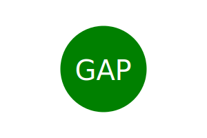
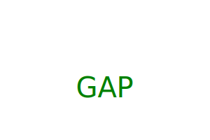

[License: GNU General Public License v3.0](https://www.gnu.org/licenses/gpl-3.0)

# SVG Logo maker

## Description
The Logo Maker SVG is a command-line interface (CLI) tool that allows you to generate SVG-based logos using basic shapes. With this tool, you can create logos with customizable text and shapes, choose colors for both the text and shape, and export the logo as an SVG file.

## Table of Contents

- [SVG Logo maker](#svg-logo-maker)
  - [Description](#description)
  - [Table of Contents](#table-of-contents)
  - [Installation](#installation)
  - [Screenshot path](#screenshot-path)
  - [Usage](#usage)
  - [Functionalities](#functionalities)
  - [Tools Used](#tools-used)
  - [License](#license)
  - [Test](#test)
  - [How to Contribute](#how-to-contribute)
  - [Questions](#questions)
  - [Credits](#credits)

## Installation 
Clone this repository to your local machine.
Navigate to the project directory.
Run the following command to install the dependencies: npm i

## Screenshot path
Here are three logos generated by this app:

Also, there is a walkthrough video at  [https://drive.google.com/file/d/14xCTvsmuoHH2pFIFHHiqbgwRBW1BFDHX/view ](https://drive.google.com/file/d/1G3AIGpeH4TV9hm43sub10CDKaRbCnDqR/view)
or scanning the following QR code 

## Usage
Users can quickly and easily create a logo SVG file using a command-line application to generate one. Only answer every question, and the users will get the logo. Most of the questions have several validations to ensure quality and reliability. Please read the prompts carefully and answer according to them.  

Open a terminal and navigate to the project directory.
Run the following command to start the Logo Maker SVG tool: node index.js

## Functionalities
Input an acronym for your logo.
Select the color of the logo's text.
Choose between three shapes: Triangle, Circle, or Square.
Pick the color of the shape.
Generate an SVG logo file based on the selected parameters.
Color validation
40 colors available and hexadecimal colors (refer to index.js).

## Tools Used
Node.js Module
Inquirer
Jest 

## License

[License: GNU General Public License v3.0](https://www.gnu.org/licenses/gpl-3.0)

## Test
To test the functionality, you can use the Jest testing framework. Import the shapes.js module and write test cases to ensure that the shapes are rendered correctly with the desired colors and text. 

## How to Contribute  
Contributions are welcome! If you encounter any issues or have suggestions for improvements, please open an issue on https://github.com/gabrielparada05/Logo-maker-svg-C10.

## Questions 
 Email: [gabrielparada05@gmail.com](mailto:gabrielparada05@gmail.com). Or, through my GitHub profile gabrielparada05, available at https://github.com/gabrielparada05.

## Credits
The Logo Maker SVG tool was developed by Gabriel Parada. Special thanks to Dane Shrewsbury, UofToronto.

